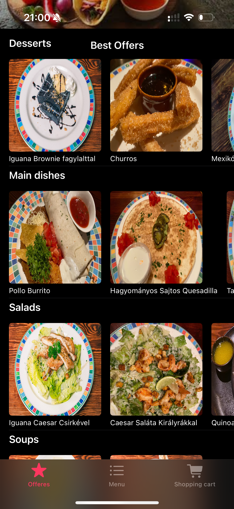
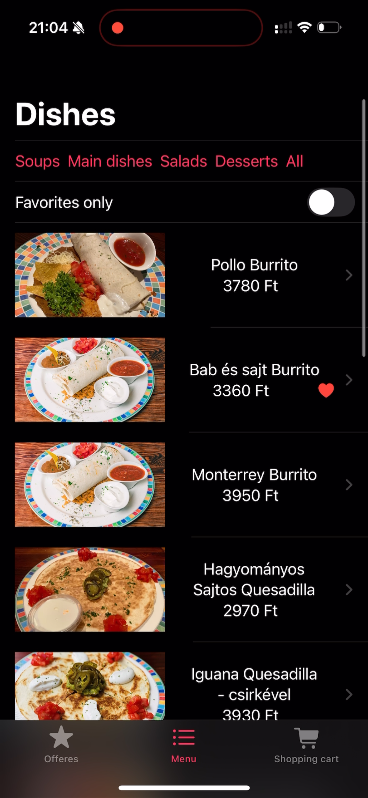
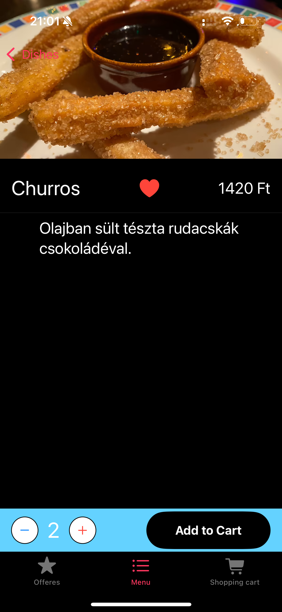
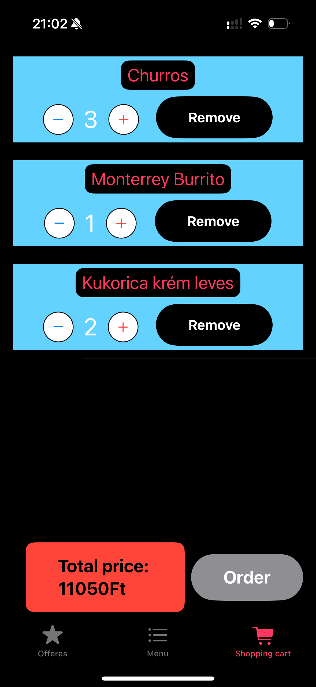

# MexiFood
Mobile application for iOS that enables users to brows through the menu of the fictional restaurant MexiFood.
It has 3 main pages, Offers, Menu and Shopping Cart with various features.

## Offers
- Shows best offers by categories (Soups, Main Dishes, Salads, Dessert)
- Each category is sideways scrollable
- Tapping a dish shows more details

## Menu
- Lists all dishes
- Filter for categories function
- Filter option for favorite dishes
- Filters can be combined (e.g. only favorite desserts)
- Tap a specific dish for more details on it

## Dish Details
- Add to favoirites
- Add item to shopping cart
- Specify the amount of selected dish to be added to the shopping cart with the "+" and "-" signs

## Shopping Cart
- Shows the items currently in the shopping cart and how many of each of them have been added
- Dinamically increase or decrease the amount of a specific dish in the shopping cart
- Remove button to delete dish from shopping cart
- Dinamically changing total price of items in the shopping cart
- Order button to place order

